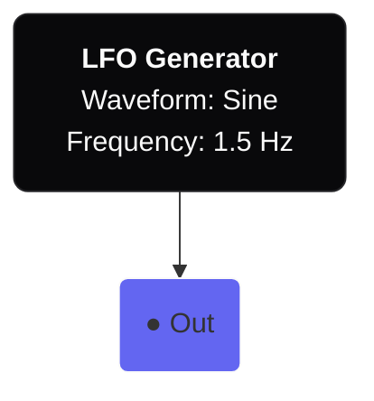
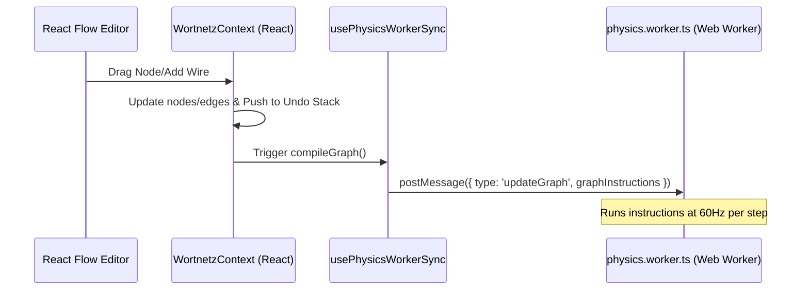
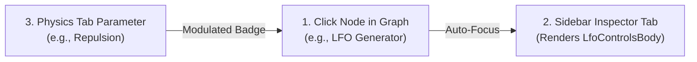
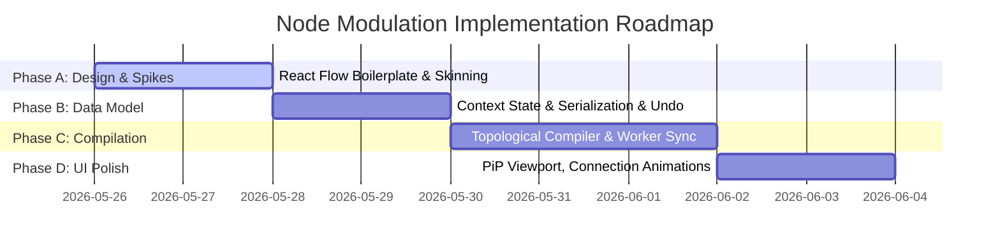

# Wortnetze — Node-Based Modulation System Architecture

This proposal outlines the design, UI layout, and structural data flow for integrating a node-based modulation/patchbay system into the Wortnetze application. 

Transitioning from a rigid, per-track LFO model to a visual node-graph (patching paradigm) allows users to create rich, organic movement. For example, chaining a *Sine LFO* through a *Math Multiply* node modulated by a *Loudness Input* node, and routing it to the *Repulsion* parameter.

---

## 1. Visual & UI Integration

A node editor requires significant screen real estate. We have analyzed three visual layout strategies for integrating `@xyflow/react` (React Flow) into the existing layout of Wortnetze:

### Option A: The "Patchbay" Viewport (Recommended)
Add a **"Nodes"** (or **"Patchbay"**) button to the 2D/3D mode toggles in the TopBar. When active:
- The main `AppCanvas` area switches from the 3D network view to the full-screen React Flow canvas.
- A **floating Picture-in-Picture (PiP) viewport** of the 3D network sits in the corner (or vice versa), allowing users to see the simulation react in real-time as they edit nodes.
- **Why this works**: Gives maximum space for laying out nodes, zoom, and pan. Keeps the layout clean and mimics high-end design/audio software (e.g., Blender's Shader Editor, TouchDesigner, Max/MSP).

### Option B: The Bottom Panel Drawer
Replace or add a tab in the bottom panel (alongside the Dopesheet and Graph Editor).
- **Why this works**: Keeps the 3D viewport fully visible at the top while editing nodes.
- **Why it fails**: Bottom panels are typically restricted to `200px - 350px` height. React Flow graphs feel extremely cramped in a narrow horizontal strip, leading to high scroll/pan fatigue.

### Option C: Right-Sidebar Tab (Embedded Graph)
Place the node graph within a tab in the right `AppSidebar`.
- **Why it fails**: Sidebar is only `320px - 400px` wide. A two-dimensional node editor is unusable in a vertical column.

---

## 2. Aesthetics & Theming (Matching our Style Guide)

To maintain Wortnetze's premium visual standard (Figma/After Effects look) and avoid default React Flow themes, we will skin the interface with custom elements:



### Skinning Guidelines
1. **Background Canvas**: The grid uses CSS custom properties `--wn-bg` (`#09090b` zinc-950 in dark mode) and a custom dot-grid matching the artboard's pasteboard style (`rgba(255,255,255,0.06)`).
2. **Custom Nodes**: Styled as sleek, dark, rounded glass cards:
   - Class: `bg-zinc-950/80 backdrop-blur-md border border-zinc-800 rounded-lg shadow-2xl p-3 text-[11px]`
   - Headers: Small, uppercase text with semantic accent colors indicating node types (e.g., generator = indigo, math = emerald, parameter = orange).
   - Value Editors: Every numeric input uses our existing `SliderParamTemplate` behavior (clickable value opening an inline editor with Esc/Enter validation).
3. **Marching Ants Connection Lines**: Active connections display running dashed animations using SVG stroke-dashoffset transitions, indicating signal flow.
4. **Drag Handles**: Custom header drag areas following the React Flow drag-handle pattern to allow seamless parameter adjustments inside the node without accidentally panning the canvas.

---

## 3. Structural Data Flow & State Management

All state must reside in `WortnetzContext.tsx` to keep `App.tsx` slim and maintain undo/redo/serialization.



### 3.1 Graph Compilation & Worker Integration
Physics parameter evaluation happens in `physics.worker.ts` at 60Hz to prevent main-thread lag. We cannot run a full React component tree or heavy JS structures in the worker RAF loop.
1. **DAG Topological Sort**: When nodes or edges change in the React thread, we perform a topological sort on the active nodes.
2. **Flat Instruction Compilation**: We compile the sorted graph into a flat, highly optimized array of instructions (bytecode-like structure) that is sent once to the worker via `updateGraph`:
   ```typescript
   type Instruction =
     | { type: 'lfo', nodeRef: string, wave: 'sine'|'triangle', rate: number, phase: number, outReg: number }
     | { type: 'math', op: 'add'|'mul', inRegA: number, inRegB: number, outReg: number }
     | { type: 'output', param: 'repulsion', inReg: number };
   ```
3. **Worker Signal Loop**: Every physics step, the worker executes this flat array sequentially, writing values to a temporary register array, and committing final outputs directly to the `appliedParams` object.

### 3.2 Undo/Redo and Workspace Serialization
- **Undo/Redo**: The list of `nodes` and `edges` will be added to the `TimelineState` in `useUndoStack.ts`. Node drags will use drag-bracketing (e.g., committing on node drag end) to ensure a single undo step per movement.
- **Serialization**: The entire node graph structure is serialized into `.wortnetz` project files in `useWorkspaceIO.ts` under a new `modulationGraph` section.

---

## 4. Node Types Directory

We propose starting with a streamlined, modular palette of nodes:

| Group | Node Type | Input Ports | Output Ports | Role |
|---|---|---|---|---|
| **Generators** | `LFO` | Rate, Phase, Depth, BPM | Signal (Value) | Generates cyclic oscillations (Sine, Tri, Square, Saw) |
| | `Perlin Noise` | Frequency, Octaves, Amplitude | Signal (Value) | Generates smooth, organic random drift |
| | `Timecode` | - | Time (Sec), Beats | Outputs elapsed playback time or tempo beats |
| **Bridges** | `Keyframe Input` | - | Signal (Value) | Outputs the keyframe-interpolated base value from a timeline track |
| **Math** | `Scale & Clamp` | Input, Min In, Max In, Min Out, Max Out | Signal (Value) | Re-maps a signal range (e.g. `[-1, 1]` to `[200, 2000]`) |
| | `Operator` | A, B | Signal (Value) | Math: Add, Subtract, Multiply, Divide |
| **Destinations**| `Physics Parameter`| Signal (Value) | - | Binds the modulated signal directly to repulsion, damping, gravity, etc. |
| | `Camera Target` | Field of View, Zoom Offset | - | Modulates the camera view |

---

## 5. Sidebar & Inspector Integration (The Workspace Overlap)

To make the Node Editor feel like a seamless part of the professional application suite rather than an isolated view, we propose a bidirectional link between the Sidebar and the Node Editor:



### 5.1 The "Inspector" Tab (VS Code / Blender Pattern)
- We will add an **Inspector** tab to the right `AppSidebar` (represented by a custom magnifying glass or gear icon in the Activity Bar).
- **Behavior**:
  - Clicking any node in the React Flow viewport automatically activates the **Inspector** tab in the sidebar and loads that node's configuration parameters.
  - If no node is selected, the Inspector tab displays a helpful default state: `"Select a node to inspect its properties."`
- **Dynamic Property UI**:
  - The Inspector tab dynamically renders UI controls based on the selected node type:
    - **LFO Node**: Renders waveform selector, rate, depth, phase, and BPM-sync controls. This directly reuses our beautifully designed `LfoControlsBody` component!
    - **Perlin Noise Node**: Renders sliders for Frequency, Octaves, and Amplitude.
    - **Scale & Clamp Node**: Renders sliders for Input Min/Max and Output Min/Max mapping.
    - **Operator Node**: Renders a dropdown to change the math operator (Add, Subtract, Multiply, Divide).

### 5.2 Bidirectional Status Badging
- In the **Physics Tab** and **Visual Tab** where raw parameters are normally edited (e.g., *Repulsion*, *Spring K*, *Node Scale*), if a parameter is connected to a node output:
  1. The slider for that parameter is styled as disabled/read-only (or shows the current animated value).
  2. A glowing **`● Modulated`** badge is displayed next to the parameter label.
  3. Clicking the `● Modulated` badge automatically switches the viewport to **Patchbay View**, centers the camera on the corresponding output node, and flashes it with an outline highlight.

### 5.3 Translation (i18n) Compliance
Following §3 of `AGENTS.md`, all user-facing labels in the Inspector and badging systems will be loaded dynamically using the `useT()` hook. The locale keys will be kept in parity across `de.json` and `en.json` (e.g., `sidebar.tab.inspector.noSelection`, `sidebar.tab.physics.modulated`).

---

## 6. Timeline Integration: The "Keyframe Input" Node
One of the hardest parts of node-based systems is how they interact with keyframe timelines. We propose a clean bridge:
1. The **Timeline / Dopesheet** animates base curves.
2. In the Node Editor, users add a **`Keyframe Input`** node. This node exposes a dropdown to select any timeline track (e.g., `Repulsion (Base curve)`).
3. The node outputs the evaluated keyframe value at the current playhead position.
4. The user can feed this into math nodes to multiply or add LFO offsets before connecting to the **`Physics Parameter (Repulsion)`** output node.
5. **Timeline Tracks**: The timeline tracks themselves become the "busses" or "control channels," keeping the timeline UI extremely clean and powerful.

---

## 7. Phase-by-Phase Roadmap



### Phase A: UI Skinning Spike (2 Days)
- Install `@xyflow/react` (React Flow).
- Build the custom Glassmorphic Node design system and the TopBar toggle mode.
- Establish theme compatibility with dark and light themes using CSS custom properties.

### Phase B: State & Serialization (2 Days)
- Add nodes, edges, and graph metadata to `WortnetzContext`.
- Update `useWorkspaceIO` to serialize the graph data.
- Wire node drag-end and connect/disconnect events to `useUndoStack`.

### Phase C: Compiler & Worker Execution (3 Days)
- Build the graph validator (avoiding feedback loops/circular paths).
- Write the topological sorting function that compiles the graph to flat instructions.
- Integrate graph message routing in `usePhysicsWorkerSync.ts` and step evaluation in `physics.worker.ts`.

### Phase D: UI Polish & Advanced Generators (2 Days)
- Add Picture-in-Picture (PiP) viewport overlay for 3D simulation feedback.
- Build visual connection feedback (animated marching ants/signals).
- Create advanced nodes (e.g. Envelope, Perlin noise).
